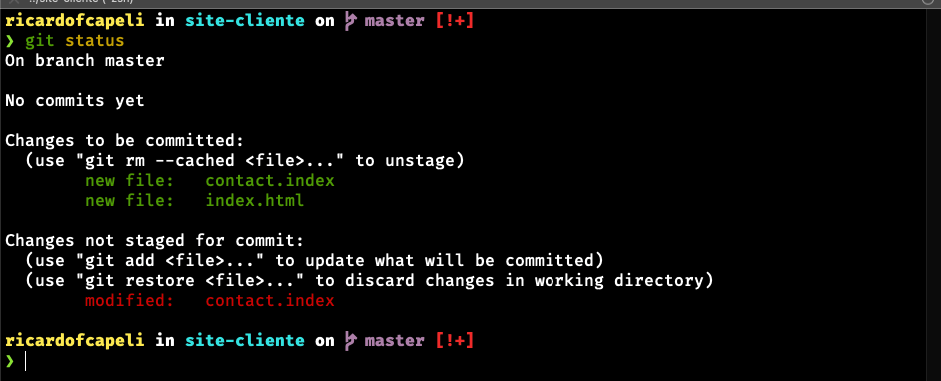
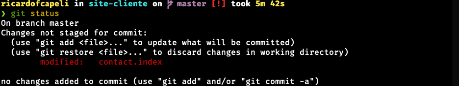

# **Obtendo um Repositório Git**

Você pode obter um projeto Git utilizando duas formas principais. 1. Você pode pegar um diretório local que atualmente não está sob controle de versão e transformá-lo em um repositório Git, ou 2. Você pode fazer um clone de um repositório Git existente em outro lugar.


# **Inicializado um repositório em um diretório existente -  Git init**

Vamos criar uma pasta e depois iniciar o repositório git.

Criar um diretório:

```
mkdir site
```

Inicializar o git neste diretório:

```
git init
```

Após a inicialização do git nesta pasta repare que será criado um arquivo _.git_. Esse arquivo contem todos os arquivos necessários de seu repositório, um esqueleto.

```
ls -la 
```


Dentro desta pasta vamos criar um arquivo chamado _index.html_:

```
touch index.html
```

Neste tópico você consegiu perceber o uso do comando **_git init_**.

# **Verificar o status de seus arquivos - Git status**

O comando **_git status_** te permite verificar o status de todos os arquivos do seu diretório. Esse comando te permite verificar o estado de cada arquivo.

Vamos voltar para a pasta e o arquivo _index.html_. Dentro da pasta criada, execute o comando:

```
git status
```


Você pode ver que o seu novo arquivo _index.html_ é um arquivo não rastreado, porque está abaixo do subtítulo “Untracked files” na saída do seu status. "Não rastreado" basicamente significa que o Git vê um arquivo que você não tinha no snapshot (commit) anterior. Isso significa que em caso de realizar um procedimento para enviar o arquivo para um repositório remoto este arquivo irá ficar de fora.


# **Git add**

Para começar a rastrear um novo arquivo, você deve usar o comando git add. Para começar a rastrear o arquivo README, você deve executar o seguinte:

```
git add index.html
```

Agora execute o comando _git status_ para verificar o estado atual do arquivo.


Veja que seu arquivo esta sendo rastreado e preparado (staged) para o commit.

Vamos adicionar nesta pasta mais um arquivo chamado _contact.index_.

Apos a criação do arquivo execute o comando _git status_ e veja como ficará:


O arquivo contact.md aparece sob a seção “Changes not staged for commit” — que indica que um arquivo rastreado foi modificado no diretório de trabalho mas ainda não foi mandado para o stage (preparado).

Assim como foi feito para adicionar o arquivo anteriormente, execute o comando _git add_ para adicionar o arquivo contact.index no rastreamento.

Supondo que você precisou modificar algum destes arquivos, vamos ver como ficaria o estado do arquivo.

Para este cenário vamos inserir alguma coisa dentro do arquivo _index.html_.


Repare que o estado do arquivo modificado esta justamente como "modified" e ainda esta com o estado de preparado para "committed".

Acontece que o Git põe um arquivo no stage exatamente como ele está no momento em que você executa o comando git add. Se você executar git commit agora, a versão do index.html que vai para o repositório é aquela de quando você executou git add, não a versão que está no seu diretório de trabalho. Se você modificar um arquivo depois de executar git add, você tem que executar git add de novo para por sua versão mais recente no stage.

Vamos adicionar essa alteração executando o comando _git add index.html_. Desta forma a sua modificação esta rastreada.


# **Git diff**

Com o comando _git diff_ você tem a possibilidade de comparar a diferença de um arquivo que você já adicionou para o commit e do estado de uma outra modificação. Para melhor compreender vamos montar o nosso cenário.

Altere o conteúdo do arquivo _contact.index_ insira qualquer texto dentro dele e depois execute o comando:

```
git diff
```


Esse comando compara o que está no seu diretório de trabalho com o que está no stage. O resultado permite que você saiba quais alterações você fez que ainda não foram mandadas para o stage.
Repare que no final dele você tem a informação do que esta sendo, no caso, adicionado.

Uma outra solução que pode te auxiliar na jornada de comparação do arquivo como estava e como ficou após a sua modificação é o comando:

```
git difftool
```


# **Realizando o commit das alterações - Git commit**


Neste momento os seus arquivos estão na área de stage isso permite que você faça o commit para ser enviado as suas modificações.

No nosso cenário, possuimos dois arquivos na área de stage e um modificação que ainda não foi adicionada para o commit.



Vamos manter desta forma, realize o comando no seu terminal:

```
git commit
```

Será aberto para você, um editor de texto definido para uso no seu terminal. 


Na primeira linha, ja te informa que você pode entrar com uma mensagem. Essa mensagem geralmente é indicado a issue que esta trabalhando e principalmente, em poucas palavras, indicar o que representa esse commit. Exemplo: Add roles finance class

Para inserir a mensagem, basta você apertar a tecla _i_ para entrar no modo insert e então preencher o texto desejado. Para sair basta apertar a tecla _esc_, depois _:_ e então _wq_ para salvar e sair do editor de texto.

O output deverá ser mais ou menos da seguinte forma:

```
[master (root-commit) bbe750a] teste
 2 files changed, 1 insertion(+)
 create mode 100644 contact.index
 create mode 100644 index.html
```

Execute o comando _git status_ e você vai ver que os dois arquivos que realizamos o commit já não aparecem:




Isso demonstra que você acaba de criar seu primeiro commit! Veja que a saída do comando fornece algumas informações: em qual branch foi feito o commit (master), seu checksum SHA-1 (463dc4f), quantos arquivos foram alterados e estatísticas sobre o número de linhas adicionadas e removidas.

**Lembre-se de que o commit grava o snapshot que você deixou na área de stage.** Qualquer alteração que você não tiver mandado para o stage permanecerá como estava, em seu lugar; você pode executar outro commit para adicioná-la ao seu histórico. Toda vez que você executa um commit, você está gravando um snapshot do seu projeto que você pode usar posteriormente para fazer comparações, ou mesmo restaurá-lo.

Uma outra alternativa ao invés de você abrir o editor de texto para inserir um comentário é o argumentos _-m_. Veja:

```
git commit -m "Add roles finance class"
```

Output

```
[master db22c46] Add roles finance class
 1 file changed, 1 insertion(+)
```

Uma alternativa muito utilizada é a possibilidade de usar os argumentos _-a_ e _-m_. Esses argumentos permite que você já adicione os arquivos para o commit e junto adiciona o seu comentario. Veja o comando:

```
git commit -a -m 'added new benchmarks'
```
Output

```
[master 47a8525] added new benchmarks
 1 file changed, 1 insertion(+), 1 deletion(-)
```

