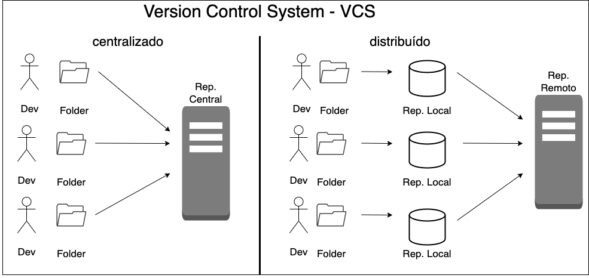
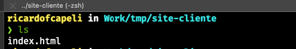
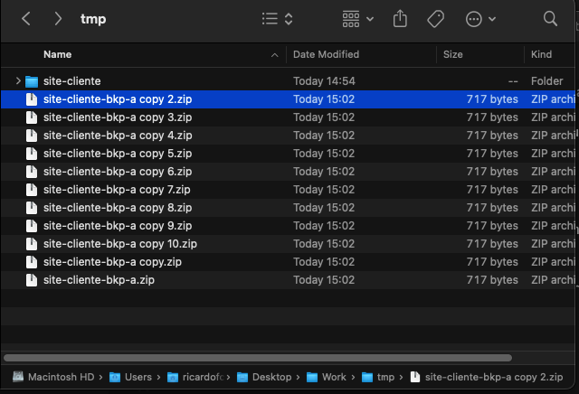
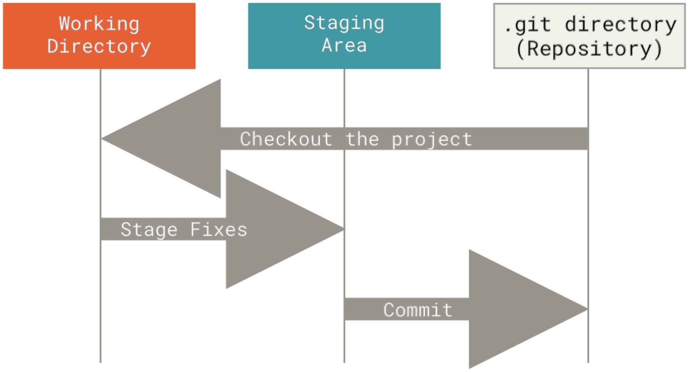

# **O que não é GIT?**

Para dar inicio a este material, o primeiro ponto é que gostaria de deixar claro é que o github é diferente de git.

O GitHub é o maior host para repositórios Git e é o ponto central de colaboração para milhões de desenvolvedores e projetos. Uma grande porcentagem de todos os repositórios Git são hospedados no GitHub, e muitos projetos de código aberto o usam para hospedagem Git, rastreamento de problemas, revisão de código e outras coisas. Portanto, embora não seja uma parte direta do projeto de código aberto Git, há uma boa chance de você querer ou precisar interagir com o GitHub em algum momento enquanto estiver usando o Git profissionalmente.
Quase uma plataforma de rede social para programadores. ;)

# **O que é o GIT?**

O Git é um projeto de código aberto maduro e com manutenção ativa desenvolvido em 2005 por Linus Torvalds, o famoso criador do kernel do sistema operacional Linux. [Atlassian](https://www.atlassian.com/br/git/tutorials/what-is-git)

# **Onde ele é utilizado?**

Um número impressionante de projetos de software depende do Git para controle de versão, incluindo projetos comerciais e de código-fonte aberto. Os desenvolvedores que trabalharam com o Git estão bem representados no pool de talentos de desenvolvimento de software disponíveis e funcionam bem em uma ampla variedade de sistemas operacionais e IDEs (Ambientes de Desenvolvimento Integrado).[Atlassian](https://www.atlassian.com/br/git/tutorials/what-is-git)

# **O que é controle de versão?**

Um termo que vai estar relacionado ao Git é o controle de versão. O controle de versão é um sistema que registra alterações em um arquivo ou conjunto de arquivo ao longo do tempo para que em um futuro você possa resgatar essas alterações.
Não necessáriamente o Git é apenas para controle de condigo fonte, você também pode controlar o versionamento de qualquer tipos de arquivos. Neste material o nosso objetivo será trabalhar com o versionamento de codigo fonte para os cenários apresentandos.

# **Como funciona o git por de baixo dos panos?**

O Git trata seus dados mais como um conjunto de imagens de um sistema de arquivos em miniatura. Toda vez que você fizer um commit, ou salvar o estado de seu projeto no Git, ele basicamente tira uma foto de todos os seus arquivos e armazena uma referência para esse conjunto de arquivos. Para ser eficiente, se os arquivos não foram alterados, o Git não armazena o arquivo novamente, apenas um link para o arquivo idêntico anterior já armazenado. O Git trata seus dados mais como um fluxo do estado dos arquivos.

**Comparação VCS antigo com o modelo mais atual que o Git trabalha**

# **Exemplo de cenário**

Imagine que foi solicitado a você que desenvolva uma pagina usando apenas um arquivo HTML.

Uma das primeiras coisas que você irá fazer é criar uma pasta no seu computador e então criar o arquivo no formato do tipo html dentro dela.

Depois da produção desta página estática, você apresenta para a pessoa que fez a solicitação para você.
Para deixar salvo, você duplica esta pasta e com a pasta duplicada é realizada a compactação para ter um backup.

Após a reunião com o seu cliente, ele faz novas solicitações de modificações da página estática. Esse processo se repete por várias e várias vezes.

No final do projeto você fez por diversas vezes alterações no arquivo index.html e possui várias pastas de backup.

Todos os seus backups que você salvou localmente ou enviou para um armazenamento em nuvem.

Em uma outra reunião com o seu cliente, ele pede para você adicionar novos itens e reutilizar as imagens que você utilizou na sua primeira entrega e as que ele tinha pedido para serem removidas. Provavelmente, se você não gravou na sua cabeça quando e onde você adicionou a imagem será o momento ideal para momento de loucura. kkkkk

Em um outro cenário nesse mesmo projeto, surge a oportunidade de trabalhar com um time de 4 pessoas além de você. Como administrar e atualizar o que cada colaborador do time produziu para a construção do produto.

E então esse é um dos grandes motivos para que em qualquer projeto seja utilizado um VCS (Version Control System).

O git é como se fosse uma máquina de voltar no tempo, onde você consegue rastrear todas as alterações realizadas em seu código.

# **Os Três Estados**

O Git tem três estados principais que seus arquivos podem estar: committed, modificado (modified) e preparado (staged). Committed significa que os dados estão armazenados de forma segura em seu banco de dados local. Modificado significa que você alterou o arquivo, mas ainda não fez o commit no seu banco de dados. Preparado significa que você marcou a versão atual de um arquivo modificado para fazer parte de seu próximo commit.
Isso nos leva a três seções principais de um projeto Git: o diretório Git, o diretório de trabalho e área de preparo.

O fluxo de trabalho básico Git:

1. Você modifica arquivos no seu diretório de trabalho.
2. Você prepara os arquivos, adicionando imagens deles à sua área de preparo.
3. Você faz commit, o que leva os arquivos como eles estão na área de preparo e armazena essa imagens de forma permanente para o diretório do Git.

# **Instalação do Git**

Geralmente nos sistemas operacionais de distribuição Linux e MacOS já vem instaldo. Caso queira realizar a instalação selecione o sistema operacional e siga os passos descritos [nesta página](https://git-scm.com/downloads).

Para realizar a instalação no sistema operacional Windows faça o download através do [link](https://git-scm.com/download/win). 

Para os demais passos, vamos utilizar o sistema operacional MacOs. Para os demais sistemas operacionais os comandos são praticamente os mesmos.

